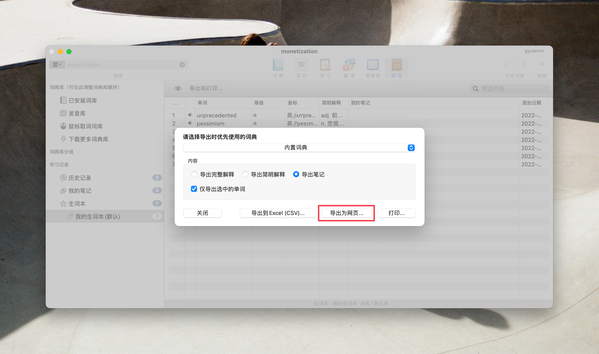
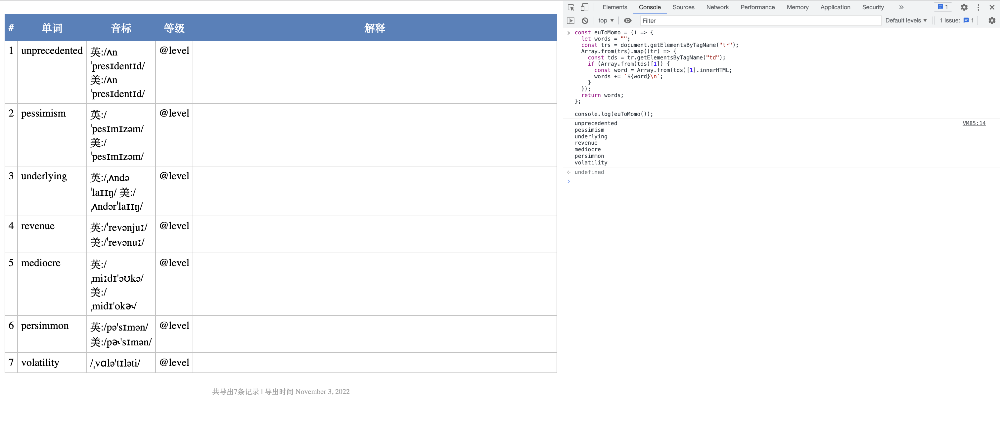

## 将Eudic欧路词典的生词导入到墨墨背单词
1. 选择欧路词典生词本，导出为网页（HTML）

2. 浏览器打开导出的HTML，打开开发者工具复制粘贴下面代码回车获取输出结果
    ```js
      const euToMomo = () => {
      let words = "";
      const trs = document.getElementsByTagName("tr");
      Array.from(trs).map((tr) => {
        const tds = tr.getElementsByTagName("td");
        if (Array.from(tds)[1]) {
          const word = Array.from(tds)[1].innerHTML;
          words += `${word}\n`;
        }
      });
      return words;
    };
    console.log(euToMomo());
    ```


3. 复制结果后，手动加入到默默背单词的云词典生词本
  <image src="./momo.jpeg" width="250" />
